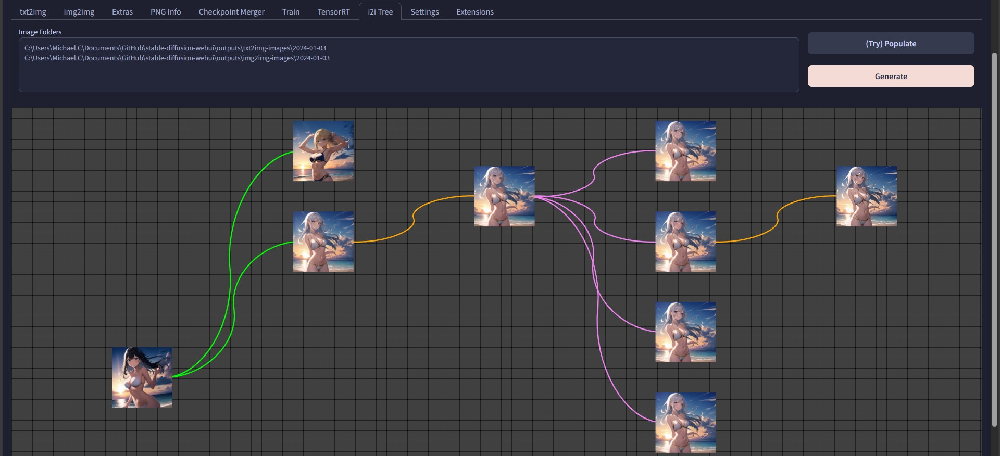

# SD Webui img2img Ancestral Tree
<h4 align = "right"><i>Beta</i></h4>

This is an Extension for the [Automatic1111 Webui](https://github.com/AUTOMATIC1111/stable-diffusion-webui), which visualizes the ancestral relationships of your **img2img** generations.

**Important:** This only works on images generated **after** the Extension is installed

## Features / How to Use
- After this Extension is installed, every `img2img` generation will embed a hash calculated from its input image
- This will also add a new **i2i Tree** tab
- Click on **Populate** to automatically fill in the latest output folders
    - Edit the fields if you want to visualize older generations
    - Separate multiple folders into individual lines
- Enable **Recursive Search** if you want to load all images under the subfolders of the specified folders
- Click on **Generate** to create the relational graph
- Source images *(**eg.** `txt2img` generations)* will appear on the left most side
- `img2img` and `Inpaint` results will appear on the right side, with colored connections showing the operation
    - **Violet:** Inpaint
    - **Orange:** Upscale
    - **Red:** Downscale
    - **Lime:** img2img

### Control
- Use **Middle Mouse** to pan/move 
- Use **Scroll Wheel** to zoom
- Pressing **Space** to quickly return to the default view
- Clicking on an image will open the file explorer, with said file highlighted

### Notice
- `Sketch` and `Inpaint sketch` results do **not** work
- If you have a lot of images, it will take a long time to load, and an even longer time as well as a large amount of RAM to generate the graphs...

## Roadmap
- [X] Checkbox for recursive processing images from folders
- [ ] More generation information
- [ ] Cache the search results in some sort of database to avoid parsing every single time
