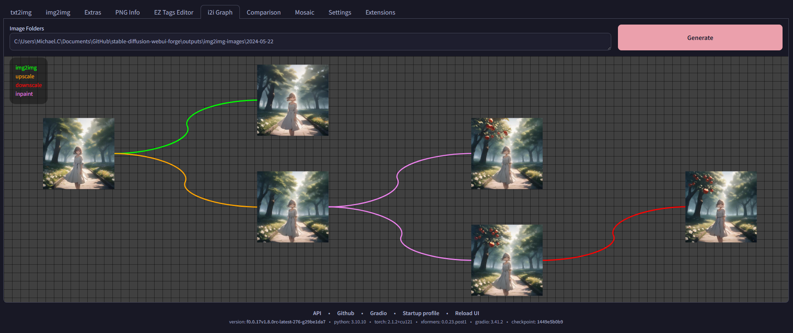

# SD Webui img2img Ancestral Graph
<h4 align = "right"><i>Beta</i></h4>

This is an Extension for the [Automatic1111 Webui](https://github.com/AUTOMATIC1111/stable-diffusion-webui), which visualizes the relationships of your **img2img** generations.

> **[Important Notes](#important)**

## Features
- After this Extension is installed, both `txt2img` and `img2img` generations will calculate a hash from the output result image, and every `img2img` generation will also calculate a hash from its input source image, and store them in databases
    - Database is based on the [diskcache](https://pypi.org/project/diskcache/) package
- This Extension will also add a new **i2i Graph** tab, which will show the relationships between the source and result images, based on the hashes mentioned above

## How to Use
- When you open the **i2i Graph** tab, the `Image Folders` field should automatically contain the latest `img2img` output folder
    - If this is the first time you launch the webui in a day, remember to edit the folder path after you generate some images
    - The path should point to the `img2img` results. The sources will be automatically detected using the hashes.
- Click on the **Generate** button to start loading and creating the relational graph

## Display
- Source *(input)* images will appear on the left side
- Result *(output)* images will appear on the right side, with colored connections showing the operation
    - **Lime:** `img2img`
    - **Orange:** `upscale`
    - **Red:** `downscale`
    - **Violet:** `inpaint`

## Control
- Use **Middle Mouse** to pan/move
- Use **Scroll Wheel** to zoom
- Pressing **Space** to restore the default view
- Clicking on an image will open the file explorer with said file highlighted
    - *Sometimes it shows up in foreground, sometimes it shows up in background...*
    - *Only tested on Win 11...*

## Important
- This only works on images generated **after** the Extension is installed
- `Sketch` and `Inpaint sketch` operations will **not** work *(since it modifies the input image)*
- The source only works when the input image is also a generated image. If you perform `img2img` from an external image, it will not show up on the graph.

#### JPEG
- By default, the `md5` function will generate different hash when the save format is set to `.jpg`, as the compression also changes the content, thus causing the Extension to not work.
- If you want to use `.jpg`, you may install the [ImageHash](https://pypi.org/project/ImageHash/) package. It will automatically switch to the `phash` function instead, and correctly generate the same hash for compressed `.jpg` images.
    - **Note:** This function takes slightly longer to calculate
    - Also, it might be able to generate the same hash if the `img2img` change is too little

## Roadmap
- [X] Cache the results in some sort of database
- [X] Optimize image loading via multithreading
- [X] Provide useful information on the Graph
- [ ] Provide more useful information on the Graph
- [ ] Add some form of loading indicator

- Many thanks to [Zyin055](https://github.com/Zyin055) for spending a lot of time testing and identifying many issues early on during the development
